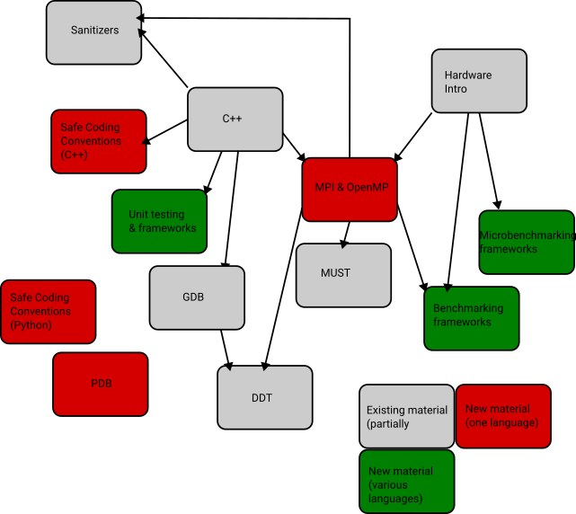

Within modern, complex software landscapes, developers typically spend a significant proportion of their time on debugging. Studies estimate that more time is required to find bugs than to write actual code. Finding bugs and delivering correct(er) code becomes more difficult with modern HPC systems which offer unprecedented concurrency: The systems become heterogeneous, i.e. process code differently, bugs become non-deterministic. Different programming models are often used in combination, complicating questions of correctness and debugging further.

### Writing correct code in London 2025

In fall 2025, the HAI-End project partnered with the CCMI CDT at UCL and Imperial to deliver a five-session workshop series on code correctness and debugging for PhD students and early-career RSEs. 
Our goal was simple but ambitious: bring systematic debugging and correctness practices to early-career researchers before bad habits take root.
We ran four sessions via Zoom covering 

- debugging with GDB
- Linaro DDT
- LLVM sanitizers, and 
- threading/MPI validation with MUST

followed by an in-person wrap-up at UCL on performance regression testing with ReFrame.
All PhD attended a warm-up session on unit testing.

#### New aspects in the course delivery (for us)

Collaborating with an RSE-focused CDT gave us three key advantages:

- Guaranteed attendance. 
  Post-COVID, our workshop attendance had plummeted. 
  Having a cohort of PhD students meant we could finally teach to a full room rather than empty halls.
- Natural evolution. 
  Originally designed for RSEs under the ExCALIBUR programme, these workshops needed a new home after ExCALIBUR ended. 
  The postgraduate audience was a perfect next step.
- Fresh perspectives. 
  CCMI's diversity—with strong interests in data science alongside traditional simulation—exposed us to new use cases and helped us envision how these workshops could evolve.
  
The feedback we received was invaluable, though not always what we wanted to hear.

#### Three Critical Lessons

##### 1. Context pitches

Most technical tutorials dive straight into hands-on exercises - the in medias res approach. 
This works at conferences where attendees are self-selected enthusiasts, but fails completely in mandatory or semi-mandatory training settings.
PhD students and RSEs need the big picture first: 
Why does this tool exist? 
What problem does it solve? 
Why should I care? 

Without this framing, even the best exercises feel pointless.
Every tutorial needs a brief motivational pitch before diving into the technical details. 
We must balance hands-on practice with sufficient context.
The context can be delivered as (very short) opening section or a pitch video; or maybe there are even better and more original ideas out there.

##### 2. Language issues

Our HPC training materials overwhelmingly focus on C and Fortran. 
This makes sense given their dominance on HPC systems, but it creates a massive accessibility problem: 
today's PhD students primarily learn Python or Julia.

We can tell ourselves "they'll eventually transition to compiled languages," but that's wishful thinking. 
PhD students are struggling to master one language while getting their research off the ground. 
It might also be tremendously dinosaurish ignoring how the computational landscape has evolved.

Anyway, if we wait for all of our audience to become "real" HPC users before offering relevant training, we'll lose most people.
We must find ways to make our debugging and performance tools accessible to higher-level languages. 
This isn't just about Python wrappers - it's about rethinking how we teach computational thinking and code quality across the abstraction spectrum.

##### 3. Back into the office

Post-COVID and for the (relatively) small, scattered ExCALIBUR community, we successively reduced our multi-day courses to workshop series spread out over multiple weeks and moved everything online. 
After that, we reduced the duration of sessions from whole-day events to 2-hour slots with asynchronous hands-on sessions conducted through Slack. 
The rationale had always been that people need to integrate upskilling into their day job and therefore appreciate content that is not widely spread out. 
Completely different was the feedback from PhD students: 
without exception, they all would have favored whole-day sessions, and we did not have a single one who favored virtual training only. 
People prefer to come together. 
There are social and community reasons for this, but they also found it easier to clarify to their supervisors that they would be absent for one day rather than for multiple two-hour slots over multiple weeks.

#### Next steps

Where do we go next? The lessons learned above lack interpretation and a discussion of logical consequences. This is something we will work toward over the upcoming months as we brainstorm future training offerings. To facilitate such brainstorming, we finally asked students to draw an optimal learning graph comprising elements of our workshop as well as sessions they felt were missing or were not integrated into the present course format. Overall, it was a success, although accompanied by many "buts." Perhaps the people who learned most from the events were we as instructors. The times are changing, and we have to adapt our training formats.

Timo Betcke (Director CCMI, UCL)
Tobias Weinzierl (HAI-End PI, Durham)

## Schedule (from original event)

This workshop series gives a hand-on introduction to modern tools for debugging and correctness checking. It consists of the following events.

[Register for webinar](https://www.eventbrite.com/e/correctness-and-debugging-workshop-series-tickets-1709762568869){: .btn .btn--event .btn--large}

| Date          | Time                  | Topic                                |
|----------------|----------------------|--------------------------------------|
| 05 November    | 1 pm – 5 pm (online) | Debugging Principles                 |
| 06 November    | 1 pm – 5 pm (online) | Linaro DDT                           |
| 26 November    | 1 pm – 5 pm (online) | Compiler Sanitizer                   |
| 28 November    | 1 pm – 5 pm (online) | Correctness Checker                  |
| 08 December    | In-Person Wrap Up Workshop at UCL | —                            |

**Acknowledgements**

In collaboration with the [UCL Advanced Research Computing Centre](https://www.ucl.ac.uk/advanced-research-computing/), the [EPSRC CCMI CDT](https://ccmi-cdt.org/), {VI-HPS}(https://www.vi-hps.org/) and the [Institute for Data Science (Durham University)](https://www.durham.ac.uk/research/institutes-and-centres/data-science/). The organisers appreciate support through the UKRI Digital Research Infrastructure Programme [grant number UKRI/ST/B000293/1 (HAI-End)].
